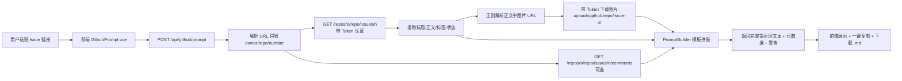

# GitHub Issue → AI 提示词生成 方案计划

## 1. 功能概述

私有 GitHub 仓库中的需求 / Bug 均以 issue 形式管理。本功能目标：

1. 用户拿到 issue 链接（需求被提出或 bug 被踢出后），粘贴到系统；
2. 系统通过 GitHub REST API 拉取该 issue 的**标题、正文（Markdown）、标签、状态、指派人与评论**，并下载正文中的**图片**到本地；
3. 系统按固定模板**生成一份可直接发送给 AI 的提示词**，提示词要求 AI：分析问题 → 判断是否需要二次确认其他信息 → 给出最优解决方案 → 输出计划 Markdown 文档，**全程不做任何代码改动**；
4. 用户复制提示词，粘贴到任意 AI 工具（如 TRAE 等）执行。

> 产物边界：本系统只负责「拉取 + 组装提示词」，**不调用 AI API、不改代码、不自动执行**。生成计划的能力由外部 AI 工具完成。

## 2. 需求理解与假设

| # | 我的理解 | 假设点（如有出入请指出） |
|---|---------|------------------------|
| 1 | 「issue 被踢出后」= issue 被提出 / 创建后 | 理解为需求或 bug 单创建后即可触发，无需关注 issue 状态流转 |
| 2 | 触发方式 = 用户拿到链接后到系统手动粘贴 | 不做 Webhook 自动监听（若需要自动生成，见第 9 节待确认项） |
| 3 | 图片 = issue 正文中的截图 / 附件图 | 下载到本机目录，提示词中以本地路径引用（私有仓库图片 URL 需认证，AI 无法直接访问原 URL） |
| 4 | 关联仓库 | 按现有代码推断为 `LeaderrunTeam/pm`（IterationService 已硬编码该地址），但做成可配置 |
| 5 | 部署形态 | 本系统与 AI 工具在同一台机器（提示词中图片用本地绝对路径，AI 可直接读取） |

## 3. 现状盘点（可复用能力）

| 能力 | 位置 | 复用方式 |
|------|------|---------|
| 外部 HTTP API 调用 | `service/JenkinsMonitorService.java`、`controller/BusinessToolController.java` | JDK 21 内置 `java.net.http.HttpClient`，零新依赖，模式直接照搬 |
| 机密加解密 | jasypt `StringEncryptor`（Jenkins 密码即此模式） | GitHub Token 同样加密存储 |
| 键值配置存储 | `SystemConfig` 实体 + `SystemConfigService` | GitHub 配置（owner/repo/token 等）存 `system_config` 表 |
| issue 链接约定 | `IterationService.generateReleaseTemplate()` | 已硬编码 `https://github.com/LeaderrunTeam/pm/issues/{n}`，确认默认仓库 |
| 迭代记录 | `Iteration` 实体含 `issueNumber/projectCode/title/issueUrl` | 可扩展「拉取后一键导入迭代记录」（v1 不做，列扩展项） |
| 本地文件目录 | `uploads/` 目录（FileController 体系外直接可用） | 图片下载落地目录 |
| 前端页面模式 | `views/JenkinsMonitor.vue` + `api/jenkinsMonitor.ts` | 页面与 API 封装风格照搬 |

## 4. 认证方案（重点：为什么不能用账号密码）

GitHub REST API 自 2020 年 11 月起**已全面禁用账号密码认证**，必须使用令牌：

| 方案 | 结论 |
|------|------|
| 账号 + 密码 | ❌ 已被 GitHub 官方禁用，API 全部返回 401 |
| Classic PAT（个人令牌） | ✅ 可用，粒度粗（repo 全权限） |
| **Fine-grained PAT（细粒度令牌）** | ✅ **推荐**：可限定仅 `LeaderrunTeam/pm` 一个仓库 + 仅授予 `Issues: Read-only`、`Contents: Read-only` 两个权限，期限可设，泄露损失面最小 |

**用户侧只需做一件事**：在 GitHub 设置页生成一个 Fine-grained PAT 并粘入系统配置（代替"提供账号密码"）。令牌经 jasypt 加密后存 `system_config` 表，明文不落盘、不打印日志、前端不回显。

> 图片下载说明：issue 正文图片（`github.com/{org}/{repo}/assets/...` 或 `user-images.githubusercontent.com/...`）属于私有仓库资产，下载时需携带 `Authorization: Bearer <token>` 请求头，`Contents: Read-only` 权限即可覆盖。

## 5. 总体架构与数据流



## 6. 配置设计（存 system_config 表）

| Key | 默认值 | 说明 |
|-----|--------|------|
| `github.base-url` | `https://api.github.com` | GitHub API 地址（支持 GHES 企业版） |
| `github.owner` | `LeaderrunTeam` | 组织名 |
| `github.repo` | `pm` | 仓库名 |
| `github.token` | 空 | Fine-grained PAT，jasypt 加密存储 |
| `github.proxy-host` / `github.proxy-port` | 空 | HTTP 代理（国内网络访问 GitHub 不稳定时的兜底） |
| `github.prompt.tech-context` | 预置模板文本 | 提示词中的"项目技术背景"段落，用户可改（如 Java 21 + SpringBoot3 微服务 / Vue3 前端） |
| `github.prompt.extra-rules` | 空 | 可追加自定义约束（可选） |

## 7. 后端改动（新增 3~4 个文件，无新依赖）

### 7.1 接口设计（`controller/GitHubIssueController.java`，`/api/github/*`）

| 方法 | 路径 | 说明 |
|------|------|------|
| GET | `/api/github/config` | 读配置（token 脱敏为 `ghp_***abc` 形式） |
| POST | `/api/github/config` | 保存配置（token 为空串表示不修改） |
| POST | `/api/github/test` | 连通性测试（拉取当前用户信息验证 token 有效性，类似 Jenkins「测试连接」） |
| GET | `/api/github/issues?state=all&page=1` | 列出仓库最近 50 条 issues（「被提出后」不用手动找链接，点选即用） |
| POST | `/api/github/issues/fetch` | 仅拉取：返回 title/body/labels/state/comments/图片清单（预览用） |
| POST | `/api/github/issues/prompt` | **核心**：一气呵成——拉取 + 下载图片 + 生成提示词，返回提示词全文 |

`prompt` 请求/响应：

```json
// 请求
{
  "issueUrl": "https://github.com/LeaderrunTeam/pm/issues/775",
  "includeComments": true,   // 必填，默认 true
  "downloadImages": true,     // 默认 true
  "maxImages": 10,            // 图片上限，防失控
  "maxBodyChars": 20000       // 正文截断阈值（超长 issue 保护提示词体积）
}
// 响应
{
  "prompt": "# 任务：分析 GitHub Issue…（全文）",
  "issue": { "number": 775, "title": "…", "url": "…", "state": "open", "labels": ["…"] },
  "images": [ { "sourceUrl": "…", "localPath": "D:/…/uploads/github/pm/issue-775/img-0.png", "downloaded": true } ],
  "warnings": ["第 3 张图片超 5MB 未下载，仅保留 URL", "正文超过 20000 字符已截断"]
}
```

### 7.2 图片下载策略（`GitHubIssueService` 内）

1. 用正则提取正文 Markdown 语法 `` 中的图片地址；
2. 分类处理：
   - `github.com` / `user-images.githubusercontent.com` 域名 → 带 Token 头下载到 `uploads/github/{repo}/issue-{n}/img-{序号}.{ext}`（扩展名从 Content-Type 推断，默认 png）；
   - 其他外部图床 URL → 不下载，原样写入提示词并给出警告（私有仓库场景很少见）；
3. 保护措施：单张 ≥ 5MB 或总数超 `maxImages` 则跳过下载、仅保留 URL 并写入 warnings；额外加 `.gitignore` 忽略 `uploads/github/`（现有 uploads 目录未忽略，避免图片入库）；
4. 提示词中引用**本地绝对路径**（正斜杠），AI 工具可直接读图。

### 7.3 提示词生成（`GitHubPromptBuilder`，常量模板 + 占位符替换）

模板用 Java Text Block 常量定义（风格对齐 `generateReleaseTemplate`），占位符替换：issue 链接、标题、标签、状态、正文（可能截断）、评论时间线、图片路径清单、技术背景、自定义规则。**v1 模板为后端常量，不做页面可视化编辑**（列为可选扩展）。

## 8. 提示词模板设计（核心产物，先给评审稿）

```markdown
# 任务：分析 GitHub Issue 并输出实施计划

你是一名资深全栈工程师与需求分析师。请基于下方材料完成分析，
最终产物是一份实施计划 Markdown 文档。
全程不做任何代码改动：不修改任何代码、配置、数据库或文件，只输出分析与计划。

## 输入材料

- Issue 链接：{issueUrl}
- 标题：{title}
- 标签：{labels}
- 状态：{state}｜指派：{assignee}

### 正文
{body}

### 评论时间线（按时间顺序）
{comments}

### 图片（本地路径，需要看图时用工具读取对应文件）
{imagePaths}

## 项目技术背景

{techContext}

## 执行要求（严格按以下顺序输出）

1. 问题分析：梳理业务背景、问题本质 / 需求要点、影响范围、涉及的
   系统与模块边界；若信息不足，明确说明缺什么。
2. 二次确认清单：列出需要向需求方二次确认的信息点，逐条标注
   [阻塞] / [非阻塞] 与建议问法；若信息充分，明确写「无需二次确认」。
3. 最优解决方案：如有多种可行方案，先对比优缺点与取舍，再给出
   最优解，含关键实现路径、改动点、边界与风险。
4. 实施计划文档：输出最终计划 Markdown，包含：目标、改动清单
   （文件 / 模块级）、实施步骤、测试与验证方案、风险与回滚预案。

## 硬性约束

- 全程不修改任何代码与配置，仅输出计划文档。
- 输出使用简体中文。
- 输出前自查：确认未对任何文件做出改动。

{extraRules}
```

> 说明：第 2 节「二次确认清单」正是你要求的"根据分析看是否需要二次确认其他信息"的落地形式——AI 先分析、再判断信息是否充分、不充分则产出可发给需求方的问题清单。

## 9. 前端改动（新增 3 个文件 + 2 处修改）

1. `types/github.ts` — TS 类型；
2. `api/github.ts` — Axios 封装；
3. `views/GithubPrompt.vue` — 页面，布局自上而下：
   - **配置区**（可折叠）：owner / repo / 基础 URL / Token / 代理 / 技术背景文本 + 「测试连接」按钮；
   - **输入区**：粘贴 URL 或「从仓库列表选择」（调列表接口，下拉选中自动回填）；
   - **选项**：包含评论（开关）、下载图片（开关）、生成按钮；
   - **预览区**：拉取后展示标题、标签、正文渲染、图片缩略图列表、评论折叠面板；无图片时自动跳过；
   - **提示词区**：只读文本框 + 「一键复制」 + 「下载 .md」；
4. `router/index.ts` 加路由 `/github-prompt`；
5. `layout/MainLayout.vue` 加菜单项「AI 提示词生成」（放在「迭代管理」附近）。

## 10. 实施步骤

| 阶段 | 内容 | 验证 |
|------|------|------|
| 1 | 配置存取：SystemConfig 读写 + jasypt 加解密 + config/test 接口 | `/api/github/test` 用真实 token 返回当前用户登录名 |
| 2 | Issue 拉取：fetch 接口（issue + comments + 列表接口） | 私有仓库任意 issue 正确返回标题正文 |
| 3 | 图片下载：正则解析 + Token 下载 + 限制策略 + .gitignore | 带截图的 issue 图片落盘且本地可打开 |
| 4 | 提示词生成：PromptBuilder + prompt 接口 | curl 返回完整提示词，占位符全部替换 |
| 5 | 前端页面：GithubPrompt.vue + 路由 + 菜单 | 粘贴 URL → 预览 → 复制提示词全流程可用 |
| 6 | 端到端验证 + 构建 | 提示词粘贴到 AI 工具跑通「输出计划 md、不改代码」；`pnpm build` + `mvn clean package -DskipTests` 通过 |

按 AGENTS.md 新增模块规范：实体/配置 → 服务（注入 `ActivityLogger` 记录拉取与生成操作日志）→ 控制器 → 前端类型 → API → 视图 → 路由 → 菜单。

## 11. 风险与注意点

| 风险 | 对策 |
|------|------|
| 国内网络访问 `api.github.com` 不稳定 | 配置项支持 HTTP 代理；test 接口即时反馈连通性 |
| Token 泄露面 | 加密存储、接口脱敏回显、日志不打印 token；建议用户用 Fine-grained PAT 限仓库限权限限期限 |
| 图片数量 / 体积失控 | maxImages 上限 + 单张 5MB 跳过下载并警告 |
| 超长 issue 导致提示词过大 | maxBodyChars 截断 + warnings 提示 |
| GitHub 限流 | 认证请求 5000 次/小时，本功能量级不可能触达 |
| 图片路径跨机不可达（系统在服务器、AI 在本机） | v1 假设同机部署用绝对路径；若异构部署，扩展「提示词 + 图片打包下载 zip」（待确认项 6） |
| AI 越界直接改代码 | 模板硬约束措辞 + 「输出前自查」要求；提示词是给外部 AI 的，最终以 AI 遵守度为准 |

## 12. 待确认问题清单

1. **触发方式**：v1 按「手动粘贴链接 + 仓库列表点选」实现。是否需要 Webhook 自动监听新 issue 并预生成提示词？（复杂度明显上升，建议 v1 不做）
2. **评论**：默认拉取全部评论（bug 复现细节常在评论中）。是否可以？（评论可能很长，会增大提示词）
3. **图片引用方式**：v1 下载到本地用绝对路径。若系统和 AI 工具跨机器，是否需要「打包下载」功能？
4. **令牌权限**：确认你可以生成 Fine-grained PAT（需 GitHub 账户在 `LeaderrunTeam/pm` 有只读权限），还是只能用 Classic PAT？
5. **默认仓库**：确认目标仓库就是 `LeaderrunTeam/pm`？（从知识库和代码推断）
6. **提示词模板**：v1 用后端常量模板。是否需要页面可视化编辑模板？（属舒适性功能，建议 v2）
7. **与迭代管理联动**：拉取后是否需要「一键导入为迭代记录」（复用 Iteration 体系，含本地目录/流程图关联）？建议 v2 独立需求评估。

## 13. 验收标准

1. 配置有效 Token 后，「测试连接」显示当前用户登录名，失败有明确报错；
2. 粘贴私有仓库 issue 链接，正确返回标题、标签、状态、正文与评论（可开关）；
3. 正文图片下载至 `uploads/github/{repo}/issue-{n}/`，提示词中为本地可读路径；
4. 生成的提示词发给外部 AI 后，AI 输出：问题分析 + 二次确认清单 + 最优方案 + 计划 Markdown，且未改动任何代码文件；
5. Token 无效 / 仓库不存在 / issue 不存在 / 网络不通，均返回友好中文错误提示；
6. 编译构建验证：先 `pnpm build` 再 `mvn clean package -DskipTests`，全部通过；
7. 操作日志：每次拉取与生成在活动日志中可见。